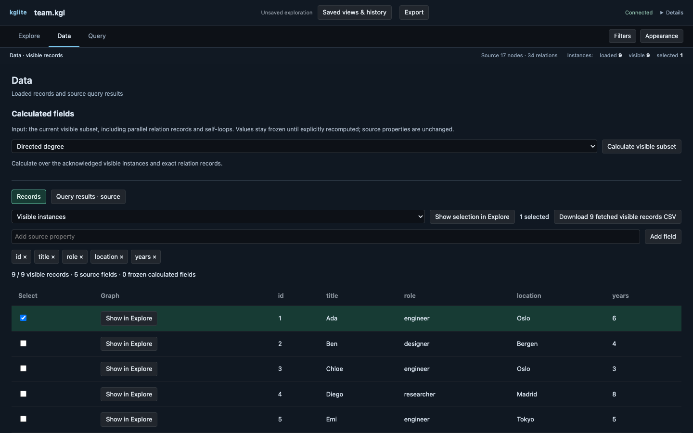
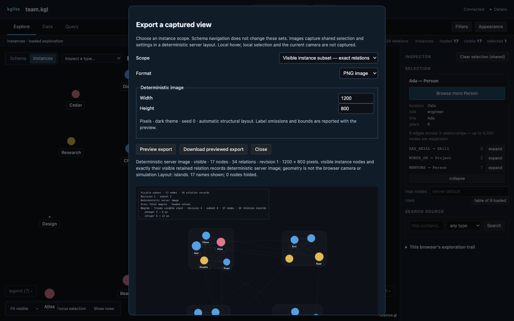

# Your first exploration

This tour uses [`team.kgl`](_static/team.kgl): nine people, three projects and
five skills connected by 34 relationships. Install the viewer and open the sample as shown in
[Getting started](getting-started.md).

The scope line is your checkpoint throughout the tour. It distinguishes the 17
instances and 34 relationships in the source from what is currently loaded,
visible and selected.

## 1. Browse the people

In **Explore**, choose **Person**. The Inspector previews the relationships
before loading anything. Set **max nodes** to 20 and choose **Browse Person
instances**.

The view now contains all nine people and zero relationships. Browse loads the
type's records, including people with no relationship to another loaded person;
relationships are loaded in the query step below.

## 2. Inspect Ada as a record

Open **Data**. Records initially shows `id` and `title`. In **Add source
property**, enter `role` and choose **Add field**; repeat for `location` and
`years`. Select Ada's row; it reads:

| Field | Value |
|---|---|
| role | engineer |
| location | Oslo |
| years | 6 |

Selection follows the source record between Data and Explore. Use **Show in
Explore** on Ada's row to return to the graph with Ada selected. See [Selection, browsing
and expansion](viewer/index.md#selection-browsing-and-expansion) for unloaded
and hidden selection states.

<a href="_static/team-records.png"></a>

## 3. Load the complete sample with a query

Open **Query**, enter the bounded query below, enable **show in graph**, and
choose **Run**:

```cypher
MATCH (a)-[r]->(b) RETURN a, r, b LIMIT 100
```

The app returns to Explore with 17 loaded instances and 34 loaded
relationships. There is no truncation warning. The Query draft remains when
you move between destinations; [Query surfaces](viewer/queries.md) covers table
answers, saved queries, the path builder, `PROFILE` and `EXPLAIN`.

## 4. Filter to engineers

Open **Filters**. Choose **category**, keep **source property** as the field
source, enter `role` as the property, leave the value type as **string**, enter
`engineer`, and choose **Apply filter**.

The scope reports 5 of 17 loaded instances visible. Filtering changes the
visible subset; it does not unload the other 12 instances. Clear the filter
before the next step so the calculation covers the complete sample.

## 5. Calculate degree

Open **Data** and find **Calculated fields**. Choose **Directed degree**, then
**Calculate visible subset**. The ready result names 17 instances and 34
relationship records. Choose **Inspect fields** and inspect Ada's **Total
degree** value: 6.

The calculation is frozen over the visible graph at the moment you ran it.
Later filtering does not recalculate it. Read [Calculations on the visible
graph](viewer/calculations.md) for self-loops, parallel relationships,
recomputation and unavailable values.

To carry the result into the exported picture, open **Appearance**. Under
**size by**, choose **Total degree** from the **Frozen calculated fields**
group. The legend identifies both the calculation and the frozen visible input
used to size the nodes.

## 6. Save and restore the exploration

Choose **Saved views & history**, name the view `Team overview`, and choose
**Save view**. This file-backed sample has stable, unique typed keys, so the
catalog can store a durable view after verifying its source.

To prove that the view is durable, stop the server with Ctrl-C and run the same
`cargo run` command again. Reopen **Saved views & history** and choose
**Restore** beside `Team overview`. The restored shared view contains 17
instances and 34 relationships, and the frozen degree calculation is still
available. Data's private column choices are browser state and are not part of
this promise.

## 7. Preview and export exactly this graph

Choose the persistent **Export** button in the workspace header. The **Export a
captured view** dialog opens directly. Set Scope to **Visible instance subset — exact relations** and Format to
**GraphML**, then choose **Preview export**. Check the preview before
downloading: it must say **17 nodes · 34 relations**. Choose **Download
previewed export**.

To reproduce the screenshot below, change Format to **PNG image**, set width to
1200 and height to 800, then choose **Preview export** again. It reports the
same 17 nodes and 34 relationships, with node size mapped to the frozen Total
degree calculation.

<a href="_static/team-export.png"></a>

The preview is tied to the current graph revision; another shared change makes
it stale and disables the download until you preview again. The [Export guide](export.md)
explains visible versus loaded-induced scope, image export and format limits.

You now have the basic workspace loop: load a bounded slice, inspect the source,
narrow the visible graph, derive a frozen result, save the exploration and
export an explicitly previewed scope. Next, open [The viewer](viewer/index.md)
for search, expansion, appearance and layouts, or [Agents and MCP](agents.md)
to let an agent work in the same shared view.
