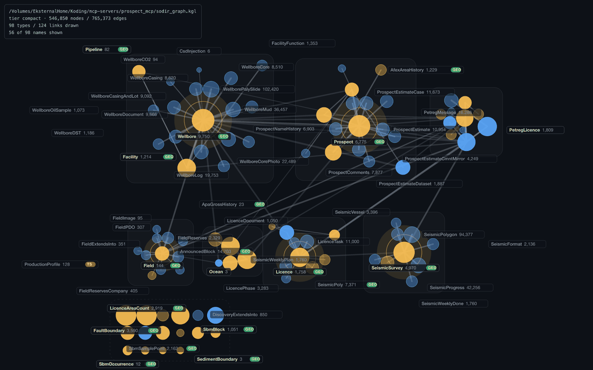
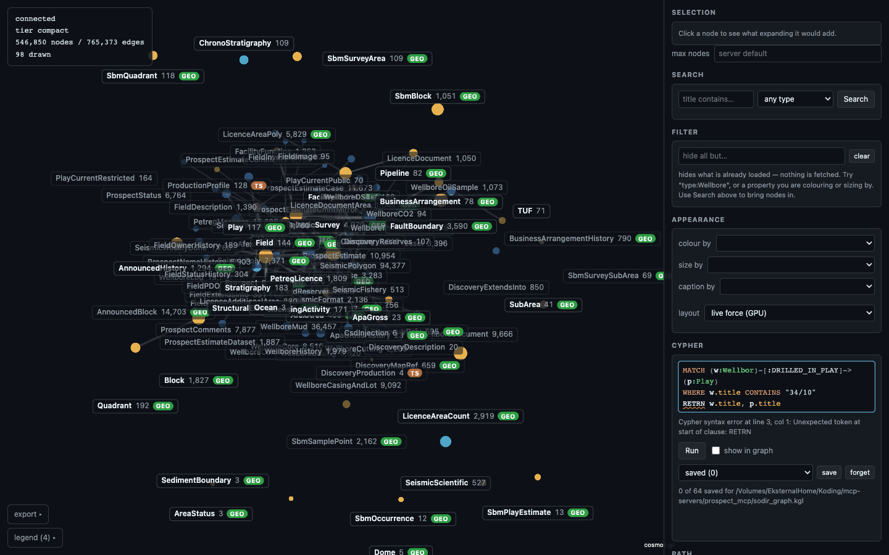

# Getting started

## Install

```bash
pip install kglite-visual
```

That is the whole install. The wheel is abi3, so one build per platform serves
every CPython from 3.10 up, and it has **no required Python runtime
dependencies**: the graph engine, the HTTP server and the compiled frontend
bundle are all inside one extension module. There is no Node to install, no
second server process to start, and no database service anywhere in the
picture.

If no wheel matches your platform, pip falls back to the source distribution.
That needs a Rust toolchain — and deliberately *not* Node: the sdist carries a
prebuilt frontend bundle, so installing from source never reaches for a
JavaScript registry.

You also need a `.kgl` file written by a matching
[kglite](https://kglite.readthedocs.io) release. This version pins
`kglite 0.16.22`.

## Open a graph

```bash
kglite-visual graph.kgl
```

The command loads the graph, binds an HTTP server on a free port on
`127.0.0.1`, prints one JSON line on stdout, and opens a browser:

```json
{"url":"http://127.0.0.1:54137/","port":54137,"pid":69850,"graph":"/path/to/graph.kgl","mcp":"http://127.0.0.1:54137/mcp"}
```

Everything else — the type counts, the response bounds, warnings — goes to
stderr:

```text
kglite-visual: 98 node types, 546850 nodes, 765373 edges; detail tier "compact"
kglite-visual: response bound 5000 nodes/expansion, 5000 rows/query, 30s query timeout
kglite-visual: 8 embedded frontend asset(s)
```

That split is a contract, not a habit. stdout is JSON and nothing else, so a
script or an agent can parse the line without scraping log output. See
[the launch contract](agents.md#the-launch-contract).

Two flags matter on the first run: `--no-open` suppresses the browser (what
every agent and CI invocation uses), and `--port N` pins the port instead of
letting the OS pick. The full list is in the [CLI reference](cli.md).

## The entry screen



What you land on is **not** the graph. It is the type-level meta-graph: one
node per node label, one link per relationship type, with counts. On the
546,850-node example above that is 98 nodes and 124 links — small enough to
draw, and small enough to *read*, whatever sits underneath.

Everything on that screen is proportional to something real:

- Circle area is member count, on a log scale, so a type with three members and
  one with a hundred thousand are both visible and clearly different.
- Link width is the number of edges the relationship type stands for.
- A **supporting** type — one that hangs off another in the graph's own type
  hierarchy — is drawn quieter than the types the graph is about.
- The badges say what a type declares: `GEO` a WKT geometry, `LOC` a lat/lon
  pair, `TS` a timeseries, `VEC` embedding vectors. `GEO` and `LOC` are
  independent — a type declaring both shows both, which is the fast way to see
  that plain coordinates are available without parsing geometry. Either one
  tells you that *instances* of that type can go on the {ref}`map layout
  <geo>` — a type itself is not anywhere, so the entry screen never offers the
  map.

The status block in the top-left is the honest header: which file is open, the
schema detail tier, the graph's totals, and how many nodes are actually drawn.

The types settle into place under a force layout, so connected types end up
near each other and the schema is visible as a shape. You can drag them.
Appending `?deterministic=1` to the URL restores the server's fixed positions
with the simulation off, which is what the test suites use.

## The first drill-in

Click a type. The **Selection** panel does not expand it — it tells you what
expanding *would* cost: the relationship types that type actually has, in each
direction, with the number of nodes each walk would add. That preview is the
point. You decide before the wire moves, not after.

Then expand. Two rules apply from here on and never stop applying:

1. **The server decides what crosses the wire.** `max nodes` in the panel is a
   request; the bound is enforced in core and clamps it.
2. **A clipped answer says so.** If the walk found more than the bound allows,
   the status bar reads *showing 400 of 11,292 nodes and 748 of up to 25,160
   links* — a count, never a silent partial answer.

The other way in is Cypher. Write a query in the panel, tick **show in graph**,
and the nodes and relationships it returns are added to the view down the same
bounded path:

```cypher
MATCH (f:Field)-[r:HAS_LICENSEE]->(c:Company) RETURN f, r, c LIMIT 500
```

The query box is a real editor: it highlights Cypher, completes labels,
relationship types and properties from your graph's own schema, and marks
mistakes *before* you run anything by sending the text to kglite's parser.



Full tour: **[the viewer](viewer/index.md)**.

## From Python

```python
import kglite_visual as kv

view = kv.show("graph.kgl")
view.url            # 'http://127.0.0.1:54137/'
view.launch_info    # {'url', 'port', 'pid', 'graph', 'mcp'}
view.close()        # 'closed'
```

`show()` starts the same server in-process. It also takes a `bytes` image of a
`.kgl`, or any object with a `to_bytes()` method — kglite's `KnowledgeGraph`
qualifies — so an in-memory graph never has to touch the disk:

```python
import kglite

graph = kglite.load("graph.kgl")
view = kv.show(graph)          # handed over through to_bytes()
```

The handle is a context manager, and it closes itself at interpreter exit.
Unlike the CLI, the wheel **writes nothing to stdout**: a library that printed
there would corrupt its caller's output. Read `launch_info` instead.

In a notebook the returned object renders itself as an iframe in the cell, and
`show()` stays quiet about opening a tab. See
[the Python API](python.md#jupyter) for what happens on a remote kernel, and
[memory](python.md#memory) for what handing over an in-memory graph costs.

## No browser at all

Two subcommands answer without a server:

```bash
kglite-visual render graph.kgl --meta -o schema.svg
kglite-visual export graph.kgl --format gexf -o graph.gexf
```

`render` draws one image and prints a JSON line describing it;
`export` writes GraphML, GEXF, CSV or D3 JSON. See [render](render.md) and
[export](export.md).

## Stopping

Ctrl-C, or `kill` the `pid` from the launch line. `SIGTERM` is caught: the
server shuts down, exits 0, releases the port, and removes the temporary
working copy kglite spills for a large graph — 370 MB for a half-million-node
file. `kill -9` skips all of that and leaves the spill behind; nothing inside a
process can prevent that.
