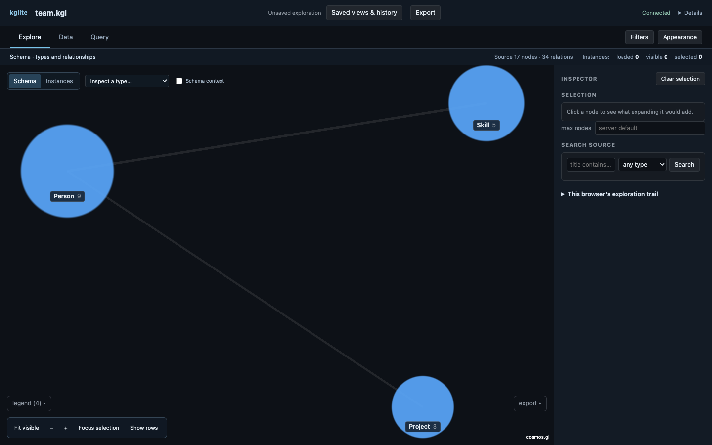

# kglite-visual

Open a `.kgl` knowledge graph as a workspace for exploring its structure,
records and query results. Start with a small schema, load only the instances
you need, and keep every partial answer visibly bounded.

<a href="_static/team-overview.png"></a>

## Take the tour

The [first exploration](first-exploration.md) uses a 17-node team graph and
finishes one complete job: open, browse, inspect, query, filter, calculate,
save, restore and export. The sample is small enough to understand by eye and
every count in the guide is checked against the real app.

Select a screenshot to open it at its full 1440 × 900 resolution.

**[Install the viewer](getting-started.md)** ·
**[Download `team.kgl`](_static/team.kgl)** ·
**[Start the walkthrough](first-exploration.md)**

For a production-scale example, [explore the public SODIR graph as an NCS
geologist](sodir-geologist.md) with the downloadable notebook.

## What the workspace does

| Destination | Use it for |
|---|---|
| **Explore** | Read the type-level schema, browse instances and inspect connections |
| **Data** | Inspect source records and frozen calculations as tables |
| **Query** | Run bounded, read-only Cypher and put its answer in Data or Explore |

Filters and Appearance narrow and style the shared view. Saved views preserve
an exploration, while Export previews the exact scope before writing a graph or
image.

Large `.kgl` files can contain far more than a browser can draw. The opening
picture is therefore a **type-level meta-graph**: one node per type and one link
per relationship type, with counts. The server decides what crosses the wire,
and a clipped result says what was omitted. Read [the viewer](viewer/index.md)
for the full interface and [the honesty model](viewer/honesty.md) for the bounds
and truncation contract.

## Other ways in

- [Python and notebooks](python.md) start the same server with `show()`.
- [Agents and MCP](agents.md) let an agent drive the workspace a person sees.
- [Render](render.md) creates an SVG or PNG without opening a browser.
- [Export](export.md) writes GraphML, GEXF, CSV or D3 JSON.
- [CLI reference](cli.md) lists every command and limit.

Rendering uses [cosmos.gl](https://cosmosgl.dev) (MIT, OpenJS Foundation), fed
by the embedded [kglite](https://kglite.readthedocs.io) engine. The frontend,
server and engine ship together; there is no database service to configure.

```{toctree}
:maxdepth: 1
:hidden:

getting-started
first-exploration
sodir-geologist
query-charts
```

```{toctree}
:maxdepth: 2
:caption: The viewer
:hidden:

viewer/index
```

```{toctree}
:maxdepth: 1
:caption: Interfaces
:hidden:

agents
python
cli
render
export
```

```{toctree}
:maxdepth: 1
:caption: Concepts
:hidden:

concepts/index
```

```{toctree}
:maxdepth: 1
:caption: Project
:hidden:

contributing
changelog
```
