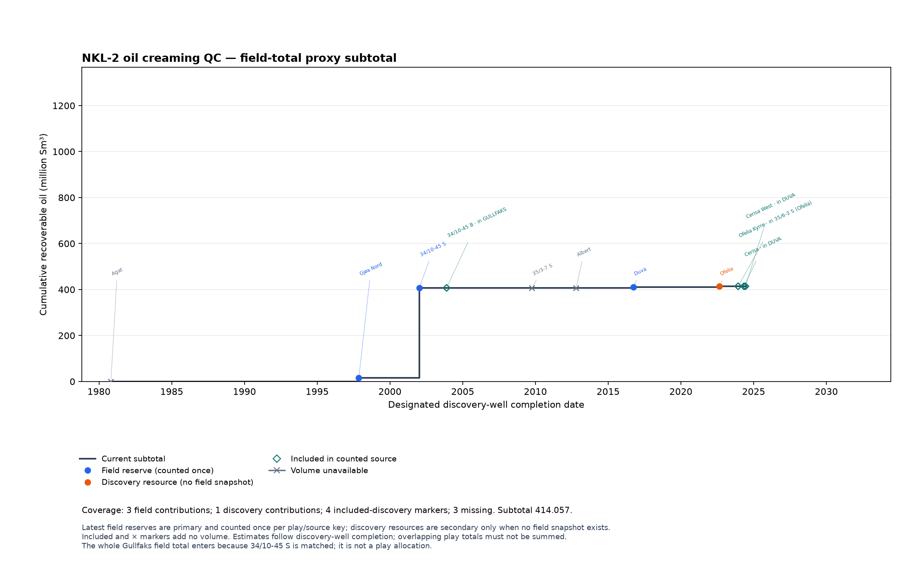
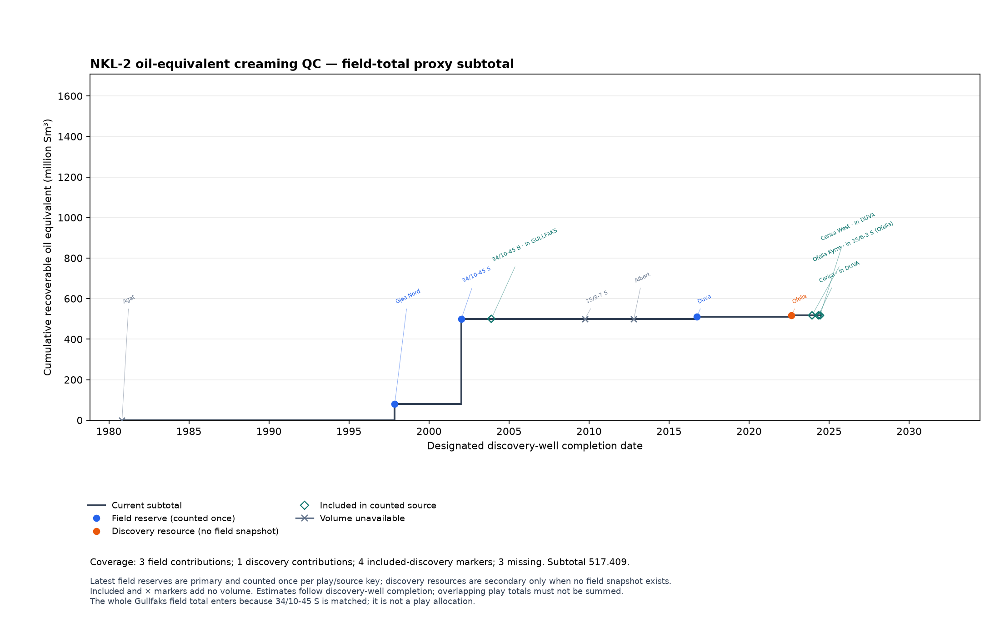

# Charts from query results

Run a bounded Cypher query with **Show in graph** unchecked, open its result in **Data**, and select **Visualize
result**. Review the suggested mapping, then select **Build chart**. **Edit
chart** reopens those controls. The chart keeps the request/query provenance
of the result that built it. Use **Download SVG** for an editable vector or
**Download PNG** for a bitmap. Chart settings themselves are workspace memory; saved queries store query text
only. Put bounded literal values in an interactive query, or retain parameter
JSON separately when calling the API.

For a grouped line, return one row per observation:

```cypher
MATCH (p:ProductionProfile)-[:OF_FIELD]->(f:Field)
WHERE f.title IN ["JOHAN SVERDRUP", "TROLL", "EKOFISK"]
UNWIND ts_series(p.prd_oil_net, '2020', '2024') AS observation
RETURN f.title AS field, observation.time AS month,
       observation.value AS monthly_oil_million_sm3
ORDER BY field, month
LIMIT 200
```

Choose `month` for x, `monthly_oil_million_sm3` for y, and `field` for the
series. This literal form runs directly in the current Query editor. API
clients can instead use `$fields` and send the list in `params`. A missing y
value remains a gap. To chart monthly-average calendar-day oil rate, confirm
the monthly source contract, enable the monthly calendar transform, set scale
to `1000000`, and label the unit `Sm³/day`. February uses its actual number of
days.

[](./_static/query-production.png)

The exported chart contains 180 monthly observations across the three fields.
Its footer records the transformation, coverage, and source query so the image
can be interpreted outside the app.

[](./_static/query-chart-workspace.png)

The chart stays beside the query result in **Data**. Switch back to **Table** to
inspect source rows, use the series checkboxes to compare selected fields, or
open **Edit chart** to review the confirmed mapping and labels.

Packed arrays are accepted when every point map contains the mapped x and y
keys, or when two explicitly paired arrays have equal length. A scalar column
on the parent row can identify the series. Visual refuses ambiguous duplicate
x values for line and bar charts, unsafe integers, invalid dates, more than 20
series, more than 5,000 expanded points, or truncated query rows/cells rather
than drawing a misleading chart. Use Cypher `UNWIND` when you want packed
points to arrive as ordinary rows with explicit columns.

## Creaming curves need membership and volume provenance

A play creaming curve needs discovery-to-play membership and a stated resource basis. The [SODIR notebook](sodir-geologist.md) uses supported `Discovery -[:IN_PLAY]-> Play` edges from published examples or compatible well age and polygon evidence. Field membership alone does not assign a play. Count distinct discovery IDs within a selected play. Cross-play results can overlap and must not be summed.

The resource rule is field first. For a selected component, the newest structured field-reserve observation contributes once within the play, deduplicated by its stable aggregation key and dated to the earliest completed covered discovery matched to that play. Later discoveries covered by that source remain named **included in counted source** timing markers. Only when no field snapshot exists may a structured discovery-resource pool contribute, also once per aggregation key. If the chosen field source lacks the requested component, the value stays missing rather than mixing bases. Numeric zero remains distinct from missing data.

These are current field and discovery resource estimates ordered by designated discovery-well completion. A field total shown in a play is context for the matched discoveries, not a geological allocation of the whole field to that play. The same field can appear in more than one play, so play subtotals must never be added together. Named × markers identify discoveries without a usable value for the selected component without inserting zero.

<a href="_static/sodir-nkl2-oil-creaming-qc.png"></a>

<a href="_static/sodir-nkl2-oe-creaming-qc.png"></a>

The 2026-09-08 NKL-2 snapshot has three field contributions, one discovery
contribution, four included-discovery markers and three unavailable values.
Its oil subtotal is 414.057 million Sm³ and its oil-equivalent subtotal is
517.409 million Sm³. The whole Gullfaks field contributes 391.148 million Sm³
oil and 419.602 million Sm³ oil equivalent because the matched discovery
34/10-45 S belongs to that field. Those figures are field-total proxies within
the selected play view, not a geological allocation of Gullfaks to NKL-2.
