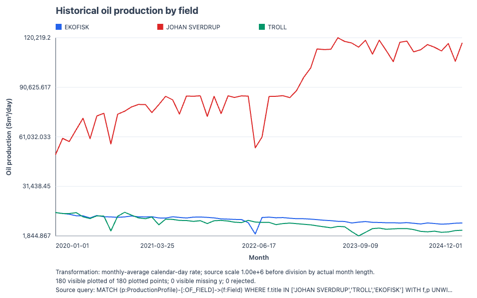
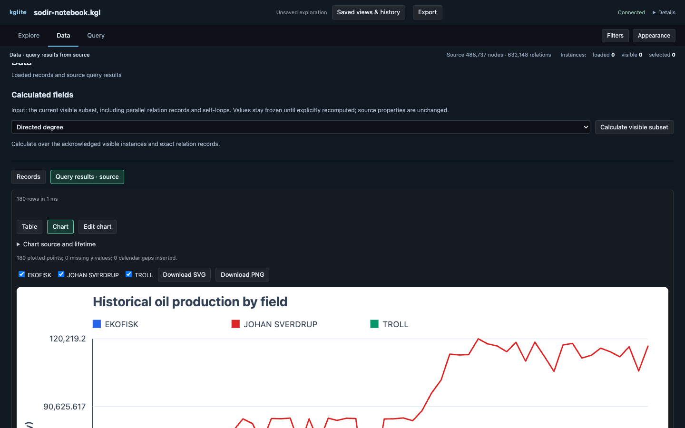

# Charts from query results

Run a bounded Cypher query with **Show in graph** unchecked, open its result in **Data**, and select **Visualize
result**. Review the suggested mapping, then select **Build chart**. **Edit
chart** reopens those controls. The chart keeps the request/query provenance
of the result that built it. Use **Download SVG** for an editable vector or
**Download PNG** for a bitmap. Chart settings themselves are workspace memory; saved queries store query text
only. Put bounded literal values in an interactive query, or retain parameter
JSON separately when calling the API.

For a grouped line, return one row per observation:

```cypher
MATCH (p:ProductionProfile)-[:OF_FIELD]->(f:Field)
WHERE f.title IN ["JOHAN SVERDRUP", "TROLL", "EKOFISK"]
UNWIND ts_series(p.prd_oil_net, '2020', '2024') AS observation
RETURN f.title AS field, observation.time AS month,
       observation.value AS monthly_oil_million_sm3
ORDER BY field, month
LIMIT 200
```

Choose `month` for x, `monthly_oil_million_sm3` for y, and `field` for the
series. This literal form runs directly in the current Query editor. API
clients can instead use `$fields` and send the list in `params`. A missing y
value remains a gap. To chart monthly-average calendar-day oil rate, confirm
the monthly source contract, enable the monthly calendar transform, set scale
to `1000000`, and label the unit `Sm³/day`. February uses its actual number of
days.

[](./_static/query-production.png)

The exported chart contains 180 monthly observations across the three fields.
Its footer records the transformation, coverage, and source query so the image
can be interpreted outside the app.

[](./_static/query-chart-workspace.png)

The chart stays beside the query result in **Data**. Switch back to **Table** to
inspect source rows, use the series checkboxes to compare selected fields, or
open **Edit chart** to review the confirmed mapping and labels.

Packed arrays are accepted when every point map contains the mapped x and y
keys, or when two explicitly paired arrays have equal length. A scalar column
on the parent row can identify the series. Visual refuses ambiguous duplicate
x values for line and bar charts, unsafe integers, invalid dates, more than 20
series, more than 5,000 expanded points, or truncated query rows/cells rather
than drawing a misleading chart. Use Cypher `UNWIND` when you want packed
points to arrive as ordinary rows with explicit columns.

## Creaming curves need membership and volume provenance

A play creaming curve needs discovery-to-play membership and a stated resource
basis. SODIR's source discovery and play tables do not contain a direct
foreign key. The [SODIR notebook](sodir-geologist.md) uses the datasets
preview's single assigned `Discovery -[:IN_PLAY]-> Play` edge: published
field examples take precedence, followed by designated-well HC ages and
polygon geometry. Same-rank ties remain unassigned and available as
`CANDIDATE_PLAY` diagnostics. Geographic overlap alone is insufficient because
plays can overlap vertically.

The notebook plots `DiscoveryVolume.recoverable_oil` in million Sm³ and
distinguishes reported resources, strict single-discovery field copies, and
the generated Troll oil allocation. Gas, NGL and condensate are excluded;
the allocation assigns all Troll oil to West and a known zero to East. It excludes inclusion-window reserve deltas from the
current-estimate curve and does not add field totals again. Missing or
unresolved estimates remain visible in coverage, never zero. The result is a
partial recoverable-oil subtotal; current estimates ordered by designated
well completion date do not reconstruct the estimates available at discovery.
