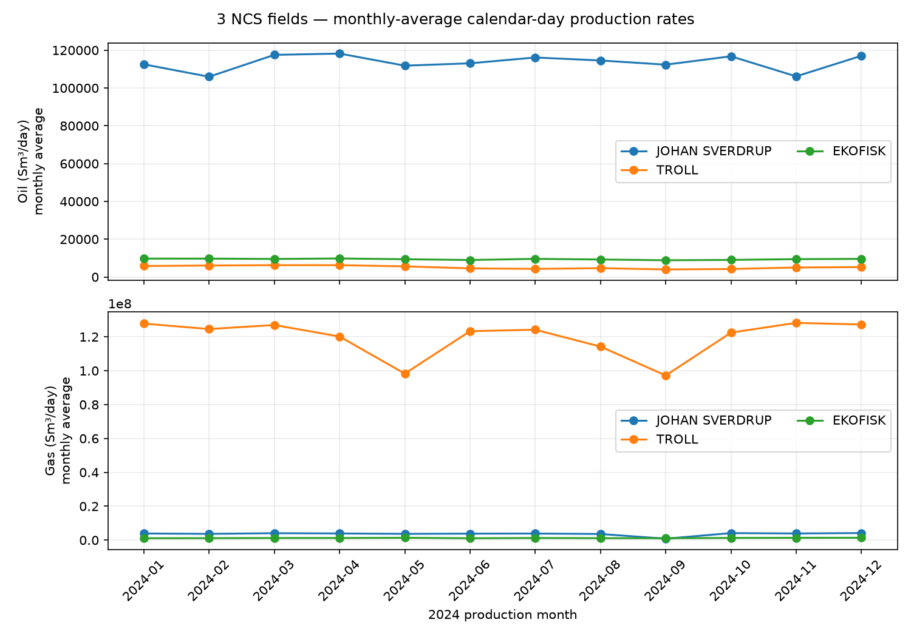

# Explore SODIR as an NCS geologist

The [downloadable SODIR notebook](_static/notebooks/sodir-geologist.ipynb)
builds the public SODIR knowledge graph, opens its saved `.kgl` file in KGLite
Visual, and drives five bounded geological investigations. It is a test project you can
rerun and adapt, with a live workspace as the main result.

```{admonition} Use the preview environment
:class: warning
The published `kglite-visual 0.1.7` wheel does not contain this workspace. The
notebook's one-time setup installs the reviewed source revision
`61e0534a89057535ba5a638dc9a83e2e0281cd78`, `kglite==0.17.1`, and
`kglite-datasets` from `4db33e083bdbf78e729f3426064be27864e8bb2b`. Run that setup before choosing the notebook kernel.
```

The loader owns a project directory containing its downloaded source cache,
the generated graph, small derived artifacts, and exports. A validated
2026-09-08 preview graph was about 115 MB. SODIR is a changing source, so a
later refresh can change its size and counts. A normal rerun reuses the graph
only when its build record matches the pinned datasets revision and live
capability queries confirm the fields, discoveries, production profiles,
formation tops, cores, and drill-stem-test records used below. Set the documented
`SODIR_FORCE_REBUILD=1` only when you intend to refresh the source under the
loader's cache cooldowns.

To inspect the normalized public source tables without building a graph, the
published `kglite-datasets 0.1.16` supports
`sodir.fetch_all(Path("sodir-review"))`. It writes normalized CSV files under
`sodir-review/csv/` and the source manifest to
`sodir-review/sodir_index.json`; the upstream API payloads are normalized to
CSV rather than retained as raw JSON. The derived play and discovery-volume
tables are not required by this demo; the pinned source revision keeps the
documented graph build reproducible.

## The geological journey

Each notebook section asks a question, puts an explicitly bounded result in
the shared Explore view, and names useful follow-up fields in Data and
Appearance.

1. **Shelf context.** Map twelve recently discovered, coordinate-bearing
   producing fields using their source geometry. Color by hydrocarbon type.
   Each point is a representative location derived from source geometry; it does not display a field outline or define reservoir extent.

<a href="_static/sodir-producing-fields-map.png"></a>

The deterministic server image supplies the coastline and graticule that the
live canvas does not draw. It contains all twelve field nodes; several labels
are omitted at this shelf-wide scale. Filter to a region and render again when
clustered names matter.
2. **Early appraisal.** Follow `Field ← Discovery ← Wellbore` for JOHAN
   SVERDRUP. The graph contains 37 linked wildcat/appraisal wellbores; the bounded earliest-twelve chronology starts with discovery well 16/2-6,
   completed 20 September 2010, and continues through eleven appraisal
   completions ending in August 2012. Inspect purpose, content, measured depth,
   and final vertical depth.
3. **Well depth context.** Combine twenty formation-level tops from 16/2-6
   with three core records and one drill-stem-test record. Formation tops use
   MD m RKB; DST uses MD m; core intervals retain the source unit metres
   because SODIR does not explicitly establish the same datum. Numeric overlap
   is not a formation assignment or connectivity claim.
4. **Production comparison.** Show three fields and their packed monthly
   `ProductionProfile` values, then compare JOHAN SVERDRUP, TROLL, and EKOFISK over the
   intentionally complete common 2024 window. Oil and gas use separate axes
   because the source scales differ. The graph contains no invented month nodes.
5. **Handoff.** Save and export an exact visible GraphML slice for the
   reviewable 16/2-6 formation-top, core, and DST neighborhood.

The notebook also includes a production chart recipe. Its query returns flat
monthly rows that can be charted directly in Visual. See
[Charts from query results](query-charts.md) for chart controls and
interpretation boundaries.

The combined well-evidence query returns 24 ordered source rows: twenty
formation-top records, three cores, and one DST. The notebook checks both node
and link truncation metadata before interpreting a picture.

<a href="_static/sodir-notebook-data.png"></a>

The query-results lane keeps `top_md_m_rkb` attached to the relationship query
that produced it; it is not presented as a Stratigraphy node property.

<a href="_static/sodir-depth-context-16-2-6.png"></a>

The lanes intentionally preserve their different source datum statements.
They show where numeric ranges overlap and stop there.

## Monthly production, stated precisely

The notebook uses type-aware Cypher `ts_series(...)` expressions on matched
`ProductionProfile` nodes while the builder graph is open, then writes only
three fields, two channels, and twelve months to a small provenance sidecar.
It releases that Python graph before starting the file-backed viewer.

For every source month it calculates:

```text
monthly-average calendar-day rate = monthly aggregate / days in that month
```

February 2024 uses 29 days. Missing input remains missing. These curves are
derived from monthly aggregates and are not day-by-day measurements.

<a href="_static/sodir-production-2024.png"></a>

Oil is sourced in million Sm³ and gas in billion Sm³, then converted to Sm³
per calendar day for the separately labelled axes. In the validated 2026-09-08 snapshot, the January Johan Sverdrup
oil value is 3.488082 million Sm³, or 112,518.77 Sm³/day as a monthly average.
In that snapshot, across 2024, Johan Sverdrup is oil-led at 41.561593 million Sm³ while Troll is
gas-led at 43.754389 billion Sm³. September gas lows identify a useful month
for comparison with other years; the graph and chart do not establish a cause.

The primary sources are SODIR's
[monthly field production table](https://factpages.sodir.no/en/field/TableView/Production/Saleable/TotalNcsMonth)
and [16/2-6 wellbore record and attributes](https://factpages.sodir.no/en/wellbore/PageView/Exploration/All/6374).
FactPages content is published under the Norwegian Licence for Open
Government Data.

## Run and continue

Download [the notebook](_static/notebooks/sodir-geologist.ipynb), complete its
one-time environment setup, and choose the **KGLite SODIR** kernel. **Run All**
leaves the owned viewer running. Open its link in a new tab to watch later
cells replace the shared view, or use the inline frame in a local notebook.
Remote notebooks use `jupyter-server-proxy` when available and otherwise show
an explicit forwarding instruction.

The last two cells are opt-in cleanup. One closes only the viewer handle owned
by the notebook. The other removes generated figures and exports after you
change its guard; the source cache and graph remain for the next run.
