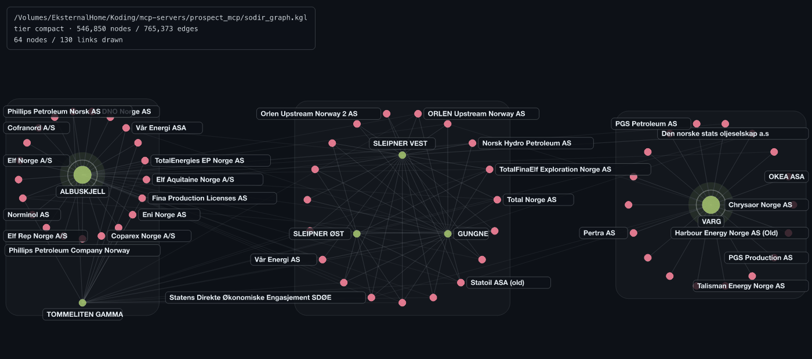
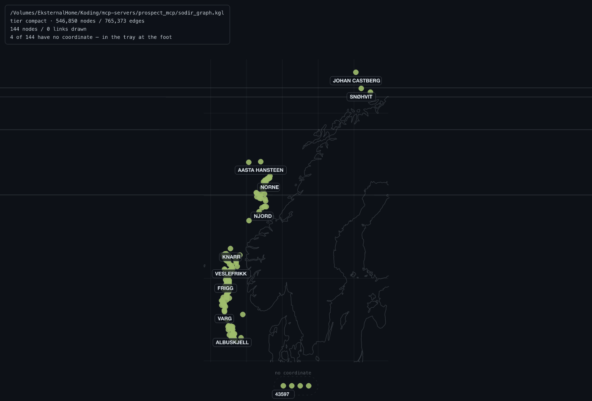

# Layouts

Two different machines arrange points in this program, and knowing which one is
running tells you what can be said about the picture.

**The live simulation** runs on your GPU, in the browser: cosmos.gl's WebGL
force layout, continuously settling. It is what every session opens in, and
while it runs the server does not know where anything ended up.

**The static kernels** run in `kglite-visual-core`, on the server. The server
computes an arrangement, broadcasts it to every attached browser, and the
browsers stop simulating and hold it still. The same kernels draw the headless
[renders](../render.md).

The **layout** picker in the Appearance panel switches between them; so do
`POST /api/layout` and the MCP `set_layout` tool.

## The live force simulation

The default. Connected types settle next to each other, so the schema is
visible as a shape rather than as a field of evenly spaced dots, and nodes can
be dragged.

`?deterministic=1` on the viewer URL restores the server's fixed positions with
the simulation off. That is what the test suites use: a running simulation
would make a position assertion a hash of vendor float behaviour.

## The static kernels

```bash
curl -s -XPOST $B/api/layout -H 'content-type: application/json' \
  -d '{"kernel":"islands"}'
```

`auto`
: Read the structure and choose. A neighbourhood becomes hop rings, a
  community-structured graph becomes packed islands, anything shapeless falls
  back to a force pass.

`radial`
: Hop rings around one node — pass `seed_slot` to say which. Same-type siblings
  are grouped into contiguous arcs, so a branch reads as a branch.

`islands`
: Communities laid out separately and packed, each with a quiet boundary drawn
  round it. A community that is two kinds of thing joined only to each other is
  drawn as two concentric shells. Unattached nodes are gathered into one
  labelled grid rather than scattered.

`force`
: A seeded Fruchterman-Reingold pass, computed here and held still. The
  fallback for input with no shape to find.

`geo`
: The [map](#geo).

`simulation`
: Hand the arrangement back to the viewer's GPU. This is the one that *takes
  knowledge away*: after it, nobody server-side knows where anything is.



The answer names `kernel_chosen`, which can differ from what was asked:
`islands` over a graph with no community structure falls back to `force` and
says so. Read it rather than assuming.

A layout request **allocates no slot, tombstones nothing and touches no link**.
It is the one operation that changes what the picture looks like without
changing what is in it.

(geo)=
## The geographic map

`--layout geo` on a render, `{"kernel":"geo"}` on a live view. Every node whose
type declares a lat/lon location or a WKT geometry is drawn **where it actually
is**.



### The projection

Equirectangular, with longitudes corrected by the cosine of the data's
mid-latitude — so a shelf at 68°N comes out its own shape rather than 2.7×
too wide.

Mercator is deliberately not used. Over 56–82°N it stretches one end of the
same picture three times as much as the other, which is a lie about relative
size in a picture whose whole point is where things are.

### The coastline

The static render draws the world's coastline and a graticule under the graph,
from **vendored TopoJSON at three scales, chosen by how much of the world the
frame covers**:

| Frame spans | Scale | Why |
|---|---|---|
| 120° or more | 1:110M — 130 arcs, 5,129 points | At 180° the finer outline's extra points land inside a pixel |
| 25° to 120° | 1:50M | At 55° — a whole continental shelf — 110M draws Norway as a lump and loses Svalbard entirely |
| Under 25° | 1:10M | Below 25° it is the only one that draws a coast at all: the fjords are structure a reader uses, not texture |

So a North Sea crop gets the fjords and a world map does not carry 400,000
points nothing can resolve. Each ring is cut to the segments the frame can see.
**No network, no tiles** — the data ships in the binary, gzipped, because the
1:10M file alone is 3.1 MB of JSON.

The live view gets the **positions only**, not the coastline, and the picker
says so.

### What it does with awkward data

- Nodes sharing a coordinate exactly — a drilling pad reported once per bore —
  are spread deterministically rather than stacked into one dot.
- Nodes with no coordinate go into a **labelled tray at the foot**, with a
  count in the status block. The image above says `4 of 144 have no
  coordinate — in the tray at the foot`. They are never dropped.
- A view where *nothing* has a coordinate is refused with a sentence rather
  than drawn empty:

  ```json
  {"error":"nothing in this view has a coordinate, so there is no map to draw. A node is placeable when its type declares a lat/lon location or a WKT geometry (`GET /api/describe` lists the types) and the node's own fields are not null."}
  ```

The picker offers the map exactly while the view holds nodes that are
somewhere. A *type* is not anywhere, so the entry screen never offers it.

## What this changes for an agent

Under the live simulation an agent can know the **content** of your view
exactly and its **geometry** not at all. Under a static kernel the server
computed the arrangement, so relative position — "the ring around X", "the
island on the left" — becomes safe to describe.

`geo` earns one more sentence than the other static kernels: the arrangement
*is* geographic, so "this node is in the Barents Sea" is a claim the picture
supports. "Top left of your screen" still is not — the camera is always the
viewer's.

The wording that comes back from `set_layout` is `geometry_caveat`, and it is
computed from `layout_kernel` rather than remembered. See
[agents](../agents.md#what-an-agent-may-claim).
